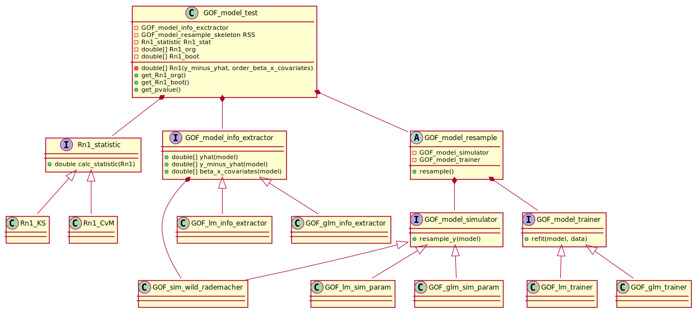

```{r, include = FALSE}
knitr::opts_chunk$set(echo = FALSE)
knitr::opts_chunk$set(
  collapse = TRUE,
  comment = "#>"
)
```

# Class-diagram

```{r, eval = FALSE, echo = FALSE}
suppressMessages(library(plantuml))
uml_str <- paste(readLines("design.plantuml"), collapse = "\n")
uml <- plantuml::plantuml(x = uml_str)
plot(uml, file = "./vignettes/class_diagram.svg")
```


* *Rn1_statistics*, *GOF_model_info_extractor*, *GOF_model_simulator* 
  and *GOF_model_trainer* follow the strategy pattern
* *GOF_model_resample* follow the template pattern.

Note that the object-oriented concepts are realized via the 
R6-package and that R6 actually does not have a real 
interface-functionality or abstract classes.

